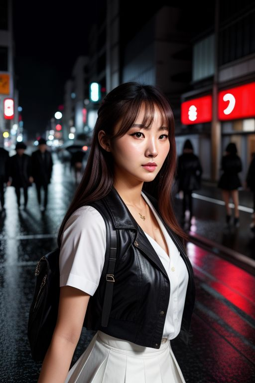

# text-to-image-generator
perchance.org提供了免费文生图服务，但是没有提供API，该脚本模拟页面操作，通过API方式调用  [Perchance's free AI image generator](https://perchance.org/image-generator-professional)
，支持生成NSFW图片
## 免责声明：本工具仅用于文生图效果评测，请不要用于黑灰产，由此造成的后果，本人概不负责
## Dependencies
Check `requirements.txt`. 
可以添加自定义关键词 `wordlist.py` wordlist或自定义风格 `styles.py` 

## About
调用脚本
```
python main.py -f newimage -n 10 -p "A Japanese school girl walks at night, in Tokyo street, rainy, neon lights" --style realistic
```


## CLI Guide
```
usage: main.py [-h] [-f FILENAME] [-n NUMBER] [-p PROMPT] [-ps PROMPT_SIZE] [-np NEGATIVE_PROMPT] [-st STYLE] [-r RESOLUTION] [-gs GUIDANCE_SCALE]

CLI Interface for Perchance's image generation.

options:
  -h, --help            show this help message and exit
  -f FILENAME, --filename FILENAME
                        Base filename for output images. Example: "new_picture".
  -n NUMBER, --number NUMBER
                        Number of images to generate.
  -p PROMPT, --prompt PROMPT
                        Prompt. Separate words with commas and spaces. Random by default.
  -ps PROMPT_SIZE, --prompt-size PROMPT_SIZE
                        Number of words to include in prompt. Applies only if random.
  -np NEGATIVE_PROMPT, --negative-prompt NEGATIVE_PROMPT
                        Negative prompt. Separate words with spaces. Includes "nudity" and "text" by default.
  -st STYLE, --style STYLE
                        Style. Random by default.
  -r RESOLUTION, --resolution RESOLUTION
                        Resolution. Example "512x768".
  -gs GUIDANCE_SCALE, --guidance-scale GUIDANCE_SCALE
                        Guidance scale for AI image generation. Float from 1 to 20.

```
